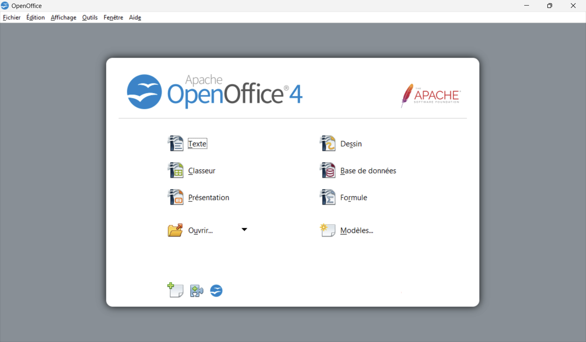

# OpenOffice.org 2.4 👋

 

 
 
 
 


OpenOffice.org 2.4 is a **free and open-source office suite** designed for **word processing, spreadsheets, presentations, graphics, databases, and more**. It offers **cross-platform compatibility**, a user-friendly interface, and a strong community-driven development model. 🚀✨

## 🔑 Key Features

- 📄 **Word Processing** (Writer) - a powerful document editor
- 📊 **Spreadsheet Analysis** (Calc) - advanced calculation and data visualization
- 🎨 **Presentations** (Impress) - professional-grade slideshow creation
- 📑 **Vector Graphics** (Draw) - diagram and flowchart design
- 📂 **Database Management** (Base) - intuitive database handling
- 🌎 **Multilingual Support** - available in multiple languages



## 🚀 Installation

You can install OpenOffice using multiple mediums

### Prerequisites 🛠️

Ensure your system meets the following requirements:

| Component        | Minimum Requirement                                                      |
| ---------------- | ------------------------------------------------------------------------ |
| Operating System | Windows 98/ME/NT (SP6+)/2000/XP                                          |
| Processor        | Pentium-compatible                                                       |
| RAM              | 64 MB (minimum)                                                          |
| Disk Space       | 250 MB (300 MB for CJK version), with 500 MB required after installation |
| Resolution       | Minimum 800x600 with 256 colors                                          |

### Install from Downloaded File 🏗️

To install using a pre-bundled version:

1. Download the latest installer from [OpenOffice.org](http://www.openoffice.org/download/).
2. Run the installer and follow the setup instructions.
3. Choose the installation directory and components.
4. Complete the installation and launch OpenOffice.org.

> [!NOTE]
> Administrator rights are required for installation on Windows NT/2000/XP.

### Alternative Installation from GitHub ⚙️

You can decide to build from source the Apache OpenOffice tools suite. To build Apache OpenOffice from source:

> [!WARNING]
> Apache OpenOffice is a large project with several dependencies, and the required prerequisites vary depending on the platform. For a detailed and up-to-date guide, refer to the [Project Wiki](https://wiki.openoffice.org/wiki/Documentation/Building_Guide_AOO).

#### Prerequisites 🛠️

Before you begin, ensure all necessary dependencies are installed on your system.

#### Build Instructions

Build OpenOffice with the following steps:

```sh
git clone https://gitbox.apache.org/repos/asf/openoffice.git aoo
cd aoo/main
autoconf
./configure <configure_switches>
./bootstrap
source *.Set.sh
cd instsetoo_native
build --all
```
> [!NOTE]
> The build process may take several hours depending on your system.

The default build will generate a setup version (e.g., `.exe` for Windows, `.dmg` for macOS, `.rpm` and `.deb` for Linux) along with an archived version. The output can be found in:

```
instsetoo_native/<output_dir>/Apache_OpenOffice/...
```

For additional details and troubleshooting, visit the [official build documentation](https://wiki.openoffice.org/wiki/Documentation/Building_Guide_AOO#Building).

## 💡 Troubleshooting

### 🚀 Problems During Startup

- Ensure your **graphics card driver** is up-to-date to prevent display issues.
- If OpenOffice.org does not start correctly, try **disabling OpenGL** via: **Tools → Options → OpenOffice.org → View → 3D View**.
- Running an older OpenOffice.org version alongside 2.4? If uninstalling the old version, run the **Repair** option in the 2.4 installer.

### 🖱️ ALPS/Synaptics Notebook Touchpads on Windows

Touchpad scrolling may not work due to a driver issue. To fix:

1. Open `C:\Program Files\Synaptics\SynTP\SynTPEnh.ini`
2. Add the following:
   ```ini
   [OpenOffice.org]
   FC = "SALFRAME"
   SF = 0x10000000
   SF |= 0x00004000
   ```
3. Restart your computer.

### 🔠 Keyboard Shortcuts

- Some shortcuts may conflict with system-assigned ones.
- Adjust OpenOffice.org shortcuts via **Tools → Customize → Keyboard**.

### 📧 Email Integration Issues

If OpenOffice.org crashes when sending a document via email, the issue is likely related to Windows MAPI. Check [Microsoft’s Knowledge Base](http://www.microsoft.com) for updates on "mapi dll" issues.

## 📚 Documentation

- [User Manual](Documents/UserManual/UserManual.pdf)
- [FAQ & Help](http://www.openoffice.org/support/)
- [License Information](http://www.openoffice.org/license.html)

## 📜 License

This project is released under the [OpenOffice.org Public License](http://www.openoffice.org/license.html). OpenOffice.org is free for use by everybody (including Government, business, educational, and private use). Please see the license text delivered with OpenOffice.org.

## 💬 Support

Join the **OpenOffice.org community** to get help and contribute:

- 📣 [Official Forums](http://forum.openoffice.org/)
- 🛠️ [Bug Reports](http://www.openoffice.org/qa/)
- 📧 [Mailing Lists](http://www.openoffice.org/mail_list.html)

## 👥 Contributing

We welcome contributions! See 
[our website](https://openoffice.apache.org/get-involved.html) for opportunities. We are actively seeking for talents for localization, porting, and marketing

## ✍️ Authors & Acknowledgments

Special thanks to all the developers, designers, and supporters who contribute daily to the evolution of this software suite.

**Enjoy using OpenOffice.org 2.4!** 🎉
